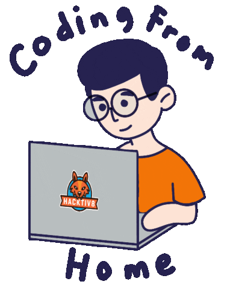

<h1 align="center">𝓗𝓮𝓵𝓵𝓸 𝓽𝓱𝓮𝓻𝓮 𝓪𝓷𝓭 𝔀𝓮𝓵𝓬𝓸𝓶𝓮 𝓽𝓸 𝓶𝔂 𝓖𝓲𝓽𝓗𝓾𝓫 𝓹𝓪𝓰𝓮!
</h1>

<!-- Typing SVG by DenverCoder1 - https://github.com/DenverCoder1/readme-typing-svg -->
<p align="center">
  <a href="https://github.com/DenverCoder1/readme-typing-svg"></a>
</p>

<!-- Social icons section -->
<p align="center">
  <a href="https://t.me/SergeevSS90"></a>
  &#8287;&#8287;&#8287;&#8287;&#8287;
  <a href="https://vk.com/id3951525"></a>
  &#8287;&#8287;&#8287;&#8287;&#8287;
  <a href="https://www.linkedin.com/in/sergeevss90/"></a>
</p>

<!-- Education section -->
<details>	
  <summary>👨‍🎓 𝓔𝓭𝓾𝓬𝓪𝓽𝓲𝓸𝓷</summary>

</details>
<!-- Tools section -->
<details>	
  <summary>🛠️ 𝓕𝓪𝓿𝓸𝓾𝓻𝓲𝓽𝓮  𝓣𝓸𝓸𝓵𝓼</summary>

</details>
<!-- Additional info section -->
<details>	
  <summary>🔍 𝓜𝓸𝓻𝓮 𝓐𝓫𝓸𝓾𝓽 𝓜𝓮</summary>
  
  ```mermaid
    gantt
    title 𝒲𝑜𝓇𝓀 𝑒𝓍𝓅𝑒𝓇𝒾𝑒𝓃𝒸𝑒
    dateFormat  YYYY-MM
    section 👨‍💻
    𝒮𝓊𝓅𝓅𝑜𝓇𝓉 𝐸𝓃𝑔𝒾𝓃𝑒𝑒𝓇         :a1, 2014-02, 912d
    С𝑜𝓂𝓂𝓊𝓃𝒾𝒸𝒶𝓉𝒾𝑜𝓃𝓈 𝐸𝓃𝑔𝒾𝓃𝑒𝑒𝓇 :a1, 2016-05, 608d
    𝒮𝓎𝓈𝓉𝑒𝓂 𝒜𝒹𝓂𝒾𝓃𝒾𝓈𝓉𝓇𝒶𝓉𝑜𝓇    :a1, 2017-07, 604d
    𝒮𝓎𝓈𝓉𝑒𝓂 𝐸𝓃𝑔𝒾𝓃𝑒𝑒𝓇          :a1, 2019-01,  1005d
    𝒬𝒜 𝐸𝓃𝑔𝒾𝓃𝑒𝑒𝓇               :a1, 2021-04, 504d
  ```
  <p align="center">
  
</p>
</details>
<!-- Github Stats section -->
<details>	
  <summary>🔥 𝓖𝓲𝓽𝓗𝓾𝓫  𝓢𝓽𝓪𝓽𝓼</summary>

  <br>
<p align=center>
  <div align=center>
    <a href="https://github.com/denvercoder1/github-readme-streak-stats" title="Go to Source">
      
    </a>
    <a href="https://github.com/anuraghazra/github-readme-stats" title="Go to Source">
      
    </a>
  </div>
  <br><br><br><br><br><br><br><br><br>
  <div align=center>
    <a href="https://github.com/anuraghazra/github-readme-stats">
      
    </a>
  </div>
  <br>
  
</p>
</details>
<!-- Repos section -->
<details>	
  <summary>💻 𝓡𝓮𝓹𝓸𝓼𝓲𝓽𝓸𝓻𝓲𝓮𝓼</summary>

</details>
