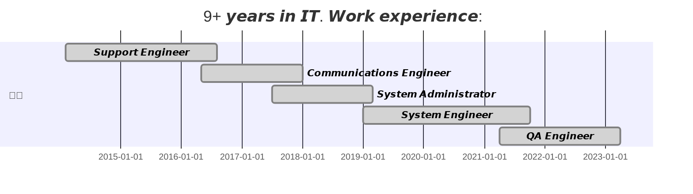
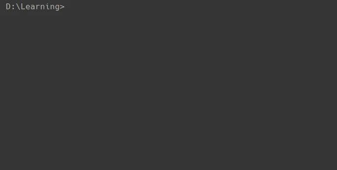
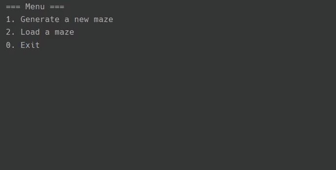
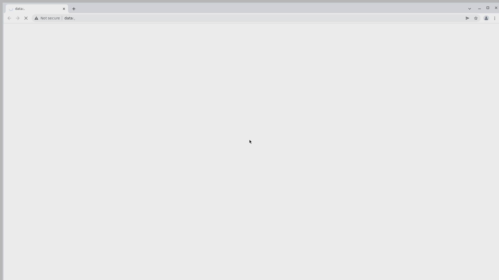

<h1 align="center">𝙃𝙚𝙡𝙡𝙤 𝙩𝙝𝙚𝙧𝙚 𝙖𝙣𝙙 𝙬𝙚𝙡𝙘𝙤𝙢𝙚 𝙩𝙤 𝙢𝙮 𝙂𝙞𝙩𝙃𝙪𝙗 𝙥𝙖𝙜𝙚!

  </h1>

<h3 align="left">
<!-- Social icons section -->

  
  &#8287;&#8287;&#8287;&#8287;&#8287;
  
  &#8287;&#8287;&#8287;&#8287;&#8287;
  
  &#8287;&#8287;&#8287;&#8287;&#8287;
  

<!-- Education section -->

	
  
👨‍🎓 𝙀𝙙𝙪𝙘𝙖𝙩𝙞𝙤𝙣 👨‍🎓

   
  <table width="100%" border='0'>
    <tr>
        <td width="30%" align="center" valign="center">
            
            </td>
            <td valign="middle">𝙎𝙖𝙧𝙖𝙩𝙤𝙫 𝙎𝙩𝙖𝙩𝙚 𝙐𝙣𝙞𝙫𝙚𝙧𝙨𝙞𝙩𝙮.
             Applied Computer Science in Sociology
             <a target="_blank" href="http://www.sgu.ru/en">SGU.RU</a>.
    </td>
</tr>
<tr>
    <td width="30%" valign="center">
        
        </td>
        <td valign="middle">𝙋𝙧𝙤𝙟𝙚𝙘𝙩-𝙗𝙖𝙨𝙚𝙙 𝙊𝙣𝙡𝙞𝙣𝙚 𝙇𝙚𝙖𝙧𝙣𝙞𝙣𝙜 𝙋𝙡𝙖𝙩𝙛𝙤𝙧𝙢.
           <a target="_blank" href="https://hyperskill.org/">HYPERSKILL.ORG</a>. My profile:
             
</td>
<tr>
    <td width="30%" valign="center">
        
        </td>
        <td valign="middle">𝙎𝙘𝙝𝙤𝙤𝙡 𝙤𝙛 𝘼𝙪𝙩𝙤𝙢𝙖𝙩𝙞𝙤𝙣 𝙏𝙚𝙨𝙩𝙞𝙣𝙜 𝙀𝙣𝙜𝙞𝙣𝙚𝙚𝙧𝙨.
             <a target="_blank" href="https://qa.guru">QA.GURU</a>. 
        </td>
    </tr>
</tr>
</table>
 
  

    
<!-- Tools section -->

	
  
🛠️ 𝙁𝙖𝙫𝙤𝙪𝙧𝙞𝙩𝙚 𝙏𝙤𝙤𝙡𝙨 🛠️

   
 🤖 𝙋𝙧𝙤𝙜𝙧𝙖𝙢𝙢𝙞𝙣𝙜 𝙖𝙣𝙙 𝙈𝙖𝙧𝙠𝙪𝙥 𝙇𝙖𝙣𝙜𝙪𝙖𝙜𝙚𝙨

  

    
    
    
    
    
    

 📚 𝙁𝙧𝙖𝙢𝙚𝙬𝙤𝙧𝙠𝙨 𝙖𝙣𝙙 𝙇𝙞𝙗𝙧𝙖𝙧𝙞𝙚𝙨

    
      
      
    
    
    
    
    
    

 🧰 𝙎𝙤𝙛𝙩𝙬𝙖𝙧𝙚 𝙖𝙣𝙙 𝙏𝙤𝙤𝙡𝙨

    
    
    
    
    
    
    
    
    
    
    
    

  
 💻 𝙎𝙚𝙧𝙫𝙚𝙧𝙨 𝙖𝙣𝙙 𝙊𝙥𝙚𝙧𝙖𝙩𝙞𝙤𝙣 𝙎𝙮𝙨𝙩𝙚𝙢𝙨

    
    
    
    
    
    
    
    
    
    

   

  
<!-- Additional info section -->

	
  
👨‍🦱 𝙈𝙤𝙧𝙚 𝘼𝙗𝙤𝙪𝙩 𝙈𝙚 👨‍🦱

  

𝙈𝙮 𝘾𝙑 𝙬𝙞𝙡𝙡 𝙗𝙚 𝙝𝙚𝙧𝙚 𝙨𝙤𝙤𝙣 😉  
  &#8287;&#8287;&#8287;&#8287;&#8287;&#8287;&#8287;&#8287;&#8287;&#8287;&#8287;&#8287;&#8287;&#8287;&#8287;&#8287;&#8287;&#8287;&#8287;&#8287;&#8287;&#8287;&#8287;𝘾𝙪𝙧𝙧𝙚𝙣𝙩𝙡𝙮 𝙬𝙤𝙧𝙠𝙞𝙣𝙜 𝙖𝙩 &#8287;
<cut/>
  𝙈𝙮 𝙙𝙤𝙜 𝙖𝙡𝙨𝙤 𝙨𝙖𝙮𝙨 "𝙃𝙄!" &#8287;
<cut/>  
 

  
🌍 𝙄 𝙨𝙥𝙚𝙖𝙠 𝙍𝙪𝙨𝙨𝙞𝙖𝙣 (𝙣𝙖𝙩𝙞𝙫𝙚), 𝙀𝙣𝙜𝙡𝙞𝙨𝙝 (𝘽2)

  
   

  
<!-- Github Stats section -->

	
  
🔥 𝙂𝙞𝙩𝙃𝙪𝙗 𝙎𝙩𝙖𝙩𝙨 🔥

   

  

    
    
  

           
  

    
  

   
  

 

  
<!-- Repos section -->

	
  
💻 𝙍𝙚𝙥𝙤𝙨𝙞𝙩𝙤𝙧𝙞𝙚𝙨 💻

      
  
	
   
🧑‍🎓 𝙅𝙚𝙩𝘽𝙧𝙖𝙞𝙣𝙨 𝘼𝙘𝙖𝙙𝙚𝙢𝙮

  

      
  <a target="_blank" align="center" href="https://hyperskill.org/projects/50?track=15">Project "BlockChain"</a>:
    

      
    </a>
    
            
  

  <a target="_blank" align="center" href="https://hyperskill.org/projects/40">Project "Linear Equations Solver"</a>:
    

      
    </a>
    
            
  

     
  <a target="_blank" align="center" href="https://hyperskill.org/projects/47?track=15">Project "Maze Runner"</a>:
    

      
    </a>
    
            
  

     
  <a target="_blank" align="center" href="https://hyperskill.org/projects/38">Project "Text Editor"</a>:
    

      
    </a>
         
          
  

  
  
 

  

	
  
🧑‍🎓 𝙌𝘼 𝙂𝙐𝙍𝙐

 
<a target="_blank" align="center" href="https://github.com/SergeevSergeiS/QA_GURU_DiplomaProject">Todoist task manager"</a>:  
    

      
    </a>
    
    

     
<h4 align="center">
  <a href="https://github.com/SergeevSergeiS?tab=repositories" title="Show Repositories">🔎 𝙎𝙝𝙤𝙬 𝙢𝙤𝙧𝙚 🔍</a>
</h4>

</h3>  
