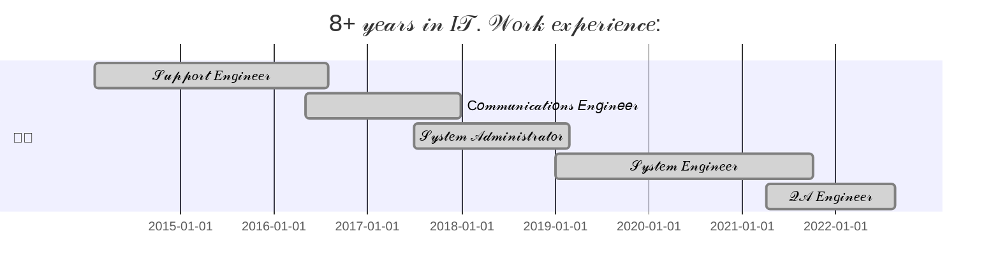

<h1 align="center">𝓗𝓮𝓵𝓵𝓸 𝓽𝓱𝓮𝓻𝓮 𝓪𝓷𝓭 𝔀𝓮𝓵𝓬𝓸𝓶𝓮 𝓽𝓸 𝓶𝔂 𝓖𝓲𝓽𝓗𝓾𝓫 𝓹𝓪𝓰𝓮!

<!-- Typing SVG by DenverCoder1 - https://github.com/DenverCoder1/readme-typing-svg -->

  </h1>

<h3 align="left">
<!-- Social icons section -->

  
  &#8287;&#8287;&#8287;&#8287;&#8287;
  
  &#8287;&#8287;&#8287;&#8287;&#8287;
  
  &#8287;&#8287;&#8287;&#8287;&#8287;
  

<!-- Education section -->

	
  
👨‍🎓 𝓔𝓭𝓾𝓬𝓪𝓽𝓲𝓸𝓷 👨‍🎓

  <table width="100%" border='0'>
    <tr>
        <td width="30%" align="center" valign="center">
            
            </td>
            <td valign="middle">𝒮𝒶𝓇𝒶𝓉𝑜𝓋 𝒮𝓉𝒶𝓉𝑒 𝒰𝓃𝒾𝓋𝑒𝓇𝓈𝒾𝓉𝓎.
             𝒜𝓅𝓅𝓁𝒾𝑒𝒹 𝒞𝑜𝓂𝓅𝓊𝓉𝑒𝓇 𝒮𝒸𝒾𝑒𝓃𝒸𝑒 𝒾𝓃 𝒮𝑜𝒸𝒾𝑜𝓁𝑜𝑔𝓎
             <a target="_blank" href="http://www.sgu.ru/en">SGU.RU</a>.
    </td>
</tr>
<tr>
    <td width="30%" valign="center">
        
        </td>
        <td valign="middle">𝒫𝓇𝑜𝒿𝑒𝒸𝓉-𝒷𝒶𝓈𝑒𝒹 𝒪𝓃𝓁𝒾𝓃𝑒 𝐿𝑒𝒶𝓇𝓃𝒾𝓃𝑔 𝒫𝓁𝒶𝓉𝒻𝑜𝓇𝓂
           <a target="_blank" href="https://hyperskill.org/">HYPERSKILL.ORG</a>. 𝑀𝓎 𝓅𝓇𝑜𝒻𝒾𝓁𝑒:
             
</td>
<tr>
    <td width="30%" valign="center">
        
        </td>
        <td valign="middle">𝒮𝒸𝒽𝑜𝑜𝓁 𝑜𝒻 𝒜𝓊𝓉𝑜𝓂𝒶𝓉𝒾𝑜𝓃 𝒯𝑒𝓈𝓉𝒾𝓃𝑔 𝐸𝓃𝑔𝒾𝓃𝑒𝑒𝓇𝓈 
             <a target="_blank" href="https://qa.guru">QA.GURU</a>. 
        </td>
    </tr>
</tr>
</table>
 
  

<!-- Tools section -->

	
  
🛠️ 𝓕𝓪𝓿𝓸𝓾𝓻𝓲𝓽𝓮  𝓣𝓸𝓸𝓵𝓼

   
 🤖 𝒫𝓇𝑜𝑔𝓇𝒶𝓂𝓂𝒾𝓃𝑔 𝒶𝓃𝒹 𝓂𝒶𝓇𝓀𝓊𝓅 𝓁𝒶𝓃𝑔𝓊𝒶𝑔𝑒𝓈

  

    
    
    
    
    
    

 📚 𝐹𝓇𝒶𝓂𝑒𝓌𝑜𝓇𝓀𝓈 𝒶𝓃𝒹 𝓁𝒾𝒷𝓇𝒶𝓇𝒾𝑒𝓈

    
      
      
    
    
    
    
    
    

 🧰 𝒮𝑜𝒻𝓉𝓌𝒶𝓇𝑒 𝒶𝓃𝒹 𝓉𝑜𝑜𝓁𝓈

    
    
    
    
    
    
    
    
    
    
    
    

  
 💻 𝒮𝑒𝓇𝓋𝑒𝓇𝓈 𝒶𝓃𝒹 𝒪𝓅𝑒𝓇𝒶𝓉𝒾𝑜𝓃 𝒮𝓎𝓈𝓉𝑒𝓂𝓈

    
    
    
    
    
    
    
    
    
    

   

<!-- Additional info section -->

	
  
🔍 𝓜𝓸𝓻𝓮 𝓐𝓫𝓸𝓾𝓽 𝓜𝓮

  

𝑀𝓎 𝒞𝒱 𝓌𝒾𝓁𝓁 𝒷𝑒 𝒽𝑒𝓇𝑒 𝓈𝑜𝑜𝓃 😉  
  &#8287;&#8287;&#8287;&#8287;&#8287;&#8287;𝒞𝓊𝓇𝓇𝑒𝓃𝓉𝓁𝓎 𝓌𝑜𝓇𝓀𝒾𝓃𝑔 𝒶𝓉 &#8287;
<cut/>
  &#8287;&#8287;&#8287;&#8287;&#8287;&#8287;&#8287;𝑀𝓎 𝒹𝑜𝑔 𝒶𝓁𝓈𝑜 𝓈𝒶𝓎𝓈 "𝐻𝐼"! &#8287;
<cut/>  
 

  
🌍 𝐼 𝓈𝓅𝑒𝒶𝓀 𝑅𝓊𝓈𝓈𝒾𝒶𝓃 (𝓃𝒶𝓉𝒾𝓋𝑒), 𝐸𝓃𝑔𝓁𝒾𝓈𝒽 (𝐵𝟤)

  
   

<!-- Github Stats section -->

	
  
🔥 𝓖𝓲𝓽𝓗𝓾𝓫  𝓢𝓽𝓪𝓽𝓼

   

  

    
    
  

           
  

    
  

   
  

 

<!-- Repos section -->

	
  
💻 𝓡𝓮𝓹𝓸𝓼𝓲𝓽𝓸𝓻𝓲𝓮𝓼

  

  
  
	
   
🧑‍🎓 𝒥𝑒𝓉𝐵𝓇𝒶𝒾𝓃𝓈 𝒜𝒸𝒶𝒹𝑒𝓂𝓎

  

      
  <a target="_blank" align="center" href="https://hyperskill.org/projects/50?track=15">Project "BlockChain"</a>:
    

      
    </a>
    
  

     
  <a target="_blank" align="center" href="https://hyperskill.org/projects/40">Project "Linear Equations Solver"</a>:
    

      
    </a>
    
  

     
  <a target="_blank" align="center" href="https://hyperskill.org/projects/47?track=15">Project "Maze Runner"</a>:
    

      
    </a>
    
  

     
  <a target="_blank" align="center" href="https://hyperskill.org/projects/38">Project "Text Editor"</a>:
    

      
    </a>
         
       
  

  
  
 

	
  
🧑‍🎓 𝒬𝒜 𝒢𝒰𝑅𝒰

 

 
<h4 align="center">
  <a href="https://github.com/SergeevSergeiS?tab=repositories" title="Show Repositories">🔎 Show More 🔍</a>
</h4>

</h3>  
